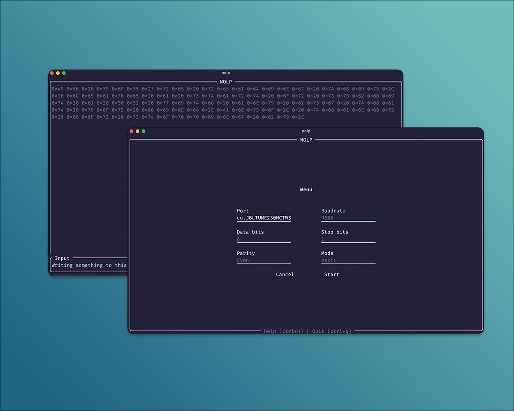

# NOLP Terminal

Terminal-based application to communicate with serial devices.
It can connect to a serial port to read output and/or write
input to a device (i.e., Arduino, ESP 32, etc.).

## Features



### Encoding

The communication to and from the serial port can be encoded with the following formats:

```
- ASCII
- Decimal
- Hex
- Octal
```

### Keymaps

All movement is based on keyboard input.
There are different screens (i.e., Menu, Device List, Help, and Terminal). The following keymaps are for screen and element navigation.

```sh
`Ctrl + n`  # Displays the menu view
`Ctrl + l`  # Displays the device list view
`Ctrl + h`  # Displays the help view
`Ctrl + q`  # Quits the application

`[`  # Selects the previous element
`]`  # Selects the next element

# Only used in the Terminal view
`Ctrl + p`  # Pause the input/output
`Ctrl + r`  # Result the input/output
```

>[!NOTE]
> At certain size-breakpoints, the application will render a scrollbar. The `movement keymaps` will control the scroll in this case.

## System Requirements

Rust version 1.71.0 or greater

There may be some dependencies that are related to `serialport-rs` as this is used for the serial port communication. Please refer to https://github.com/serialport/serialport-rs#dependencies for those requirements.

## Building from Source

The build should be as simple as using `cargo build`
